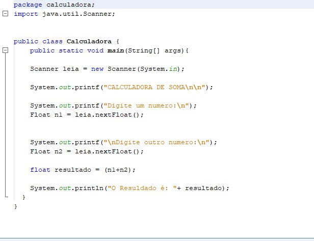
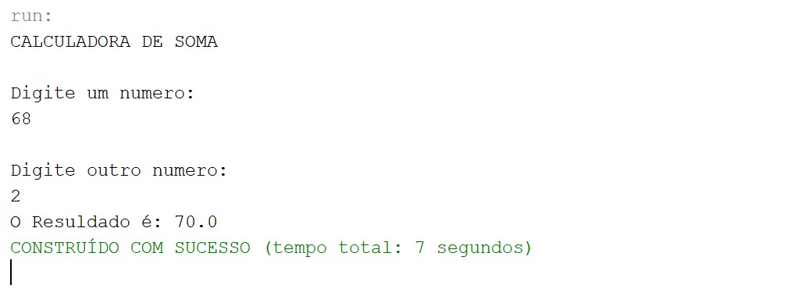

# 
Calculadora que somente 2 números que você digitar no terminal
<h1>Soma 2 numeros Terminal - Java 🧮</h1>

<h2>Soma de 2 numeros no terminal feita em JAVA</h2>

<h2>Explicação:</h2>

Coloque 2 numeros para somar.

<h2>💻Tecnologias</h2>

- JAVA 

- GIT e GitHub 

<h2>📱Contato</h2>

viktorariel777@gmail.com

